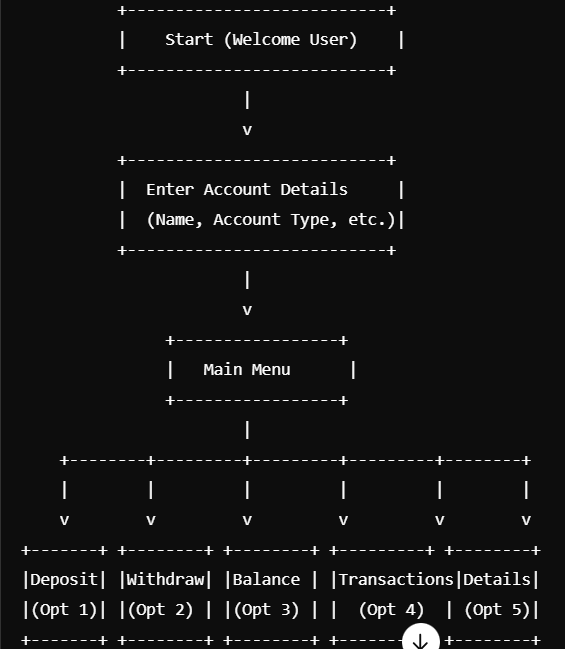
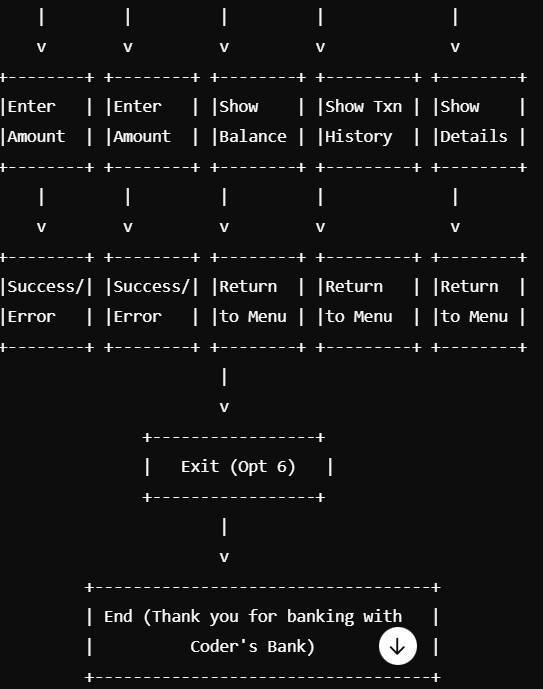
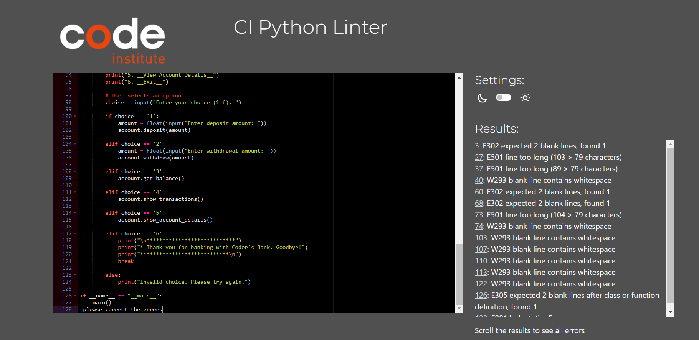
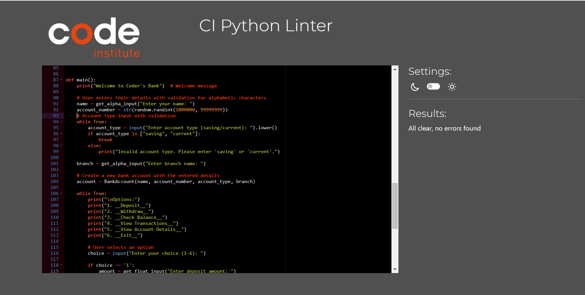

# Coders Bank

## Project Overview

**Coders Bank** is a Python-based banking application developed as part of my Full Stack Developer course at Code Institute. The application allows users to manage their bank accounts, including creating accounts, making deposits and withdrawals, checking balances, and viewing transaction histories. The application is deployed on Heroku.  <a href="https://coder-sbank-e7fe4d99df38.herokuapp.com/" target="_blank" rel="noopener">Coder's Bank</a>

## Inspiration and Development

The Coders Bank project was inspired by a desire to create a functional and practical banking application that leverages my full-stack development skills. The idea was to build a simple, user-friendly app that demonstrates core banking functionalities while showcasing the knowledge gained from Code Institute. The project was developed using Python and deployed to Heroku, drawing from the extensive course materials and support provided by Code Institute.

## Features

- **Account Creation:** Users can set up new accounts with their personal details, including name, account number, account type, and branch.
- **Deposit:** Users can deposit money into their account.
- **Withdraw:** Users can withdraw money from their account, provided sufficient balance is available.
- **Check Balance:** Users can view their current account balance.
- **View Transactions:** Users can see a history of all transactions.
- **View Account Details:** Users can view their account information including balance and transaction history.

## How Coders Bank Works

The application follows a structured process to manage banking operations. Here's a detailed overview of how the app functions:

1. **Account Initialization:**
   - The user starts by entering their first name, account type (saving or current), and branch name.
   - A unique account number is generated randomly for the new account.
   - An instance of the `BankAccount` class is created with these details.

   

   

2. **User Interaction:**
   - The user is presented with a menu of options:
     1. **Deposit:** Prompts the user to enter the amount to deposit. If the amount is positive, it is added to the account balance and recorded in the transaction history.
    

     2. **Withdraw:** Prompts the user to enter the amount to withdraw. The app checks if the balance is sufficient before proceeding with the withdrawal.
    

     3. **Check Balance:** Displays the current balance of the account.
    

     4. **View Transactions:** Shows a history of all transactions made in the account.
    

     5. **View Account Details:** Displays the account details including name, account number, account type, branch, and current balance.
    

     6. **Exit:** Ends the session and displays a thank-you message.
    

3. **Input Validation:**
   - The app ensures that only valid inputs are accepted. For example, deposit and withdrawal amounts must be positive, and account types must be either 'saving' or 'current'. User inputs are validated to ensure they are alphabetic where required.

4. **Transaction Management:**
   - All deposit and withdrawal transactions are recorded in the account's transaction history, which can be viewed at any time.

## Flow chart

## Error Handling and Fixes

During the development of Coders Bank, several errors were identified and addressed to ensure the application's functionality and adherence to coding standards. Below are the errors found and how they were fixed:

### Errors Found

1. **Python Linter Errors**:
   - **Code Style Issues**: The Python linter identified improper indentation, unused variables, and inconsistent formatting.
   - **Code Line Length**: Some lines of code exceeded the recommended maximum line length, which affected readability and compliance with PEP 8 standards.

2. **Validation Errors**:
   - Errors in input validation were found, such as ensuring that numeric inputs were positive and that only alphabetic characters were allowed where required.

### Fixes Implemented

1. **Code Style Corrections**:
   - **Indentation and Formatting**: Fixed indentation and formatting issues as flagged by the linter.
   - **Unused Variables**: Removed unused variables and corrected variable names for clarity.

2. **Code Line Length**:
   - **Line Length**: Refactored code to ensure that all lines adhere to the recommended maximum line length , improving readability and maintaining compliance with PEP 8 standards. 

3. **Enhanced Input Validation**:
   - Improved validation functions to handle edge cases more effectively. For example, the deposit and withdrawal functions were updated to ensure only positive amounts were processed, and error messages were made more informative.

4. **Error Messages and Handling**:
   - Enhanced error messages to provide clearer feedback to users. For instance, when a user tries to withdraw more than the available balance, a more detailed message is displayed.

5. **Testing and Verification**:
   - Conducted thorough testing to verify that all fixes resolved the identified issues and that the application functions as expected under various scenarios.

These fixes have been validated to ensure that the application is now working properly and adheres to best practices.

## Deployment

To deploy the Coders Bank project:

1. **Create a New Heroku App**
   - Go to the Heroku dashboard.
   - Click "New" and select "Create new app."
   - Choose an available app name.
   - Select the region where you are working from (e.g., Europe).
   - Click the "Create app" button.

2. **Configure Environment Variables**
   - Click on "Settings" from the main menu.
   - Scroll down to the "Config Vars" section and click "Reveal Config Vars."
   - In the "Key" field, input `PORT` and in the "Value" field, input `8000`.
   - Click "Add" to save.
   - Repeat this process to create a key called `CREDS` and paste the values from the `CREDS.json` file in Gitpod to hide sensitive data from the user.

3. **Add Buildpacks**
   - Scroll down to "Add buildpack" and select it.
   - Choose "Python" and click "Save changes."
   - Click "Add buildpack" again and do the same with "Node.js."

4. **Link to GitHub Repository**
   - Go to the "Deploy" tab.
   - Select "GitHub" as the deployment method.
   - Search for your repository and click "Connect."

5. **Automatic Deploys**
   - In the "Automatic deploys" section, select the branch you want to deploy from (e.g., `main` or `master`).
   - Click "Enable Automatic Deploys" to deploy new commits automatically.

With these steps,the Coders Bank app will be deployed on Heroku and ready for use.

**Cloning the Repository**

To create a local clone of this project
The method from cloning a project from GitHub is below:

- 1.Under the repository’s name, click on the code tab.
- 2.In the Clone with HTTPS section, click on the clipboard icon to copy the given URL.
- 3.In your IDE of choice, open Git Bash.
- 4.Change the current working directory to the location where you want the cloned directory to be made.
- 5.Type git clone, and then paste the URL copied from GitHub.
- 6.Press enter and the local clone will be created.

## Learning Experience

Developing Coders Bank has been a valuable learning experience. The project utilized the course material provided by Code Institute, which was crucial in understanding and implementing various full-stack development concepts. The support from Code Institute’s tutors and student support team was instrumental throughout the development process.

## Credits

I would like to express my deepest gratitude to the following individuals and resources, whose support and contributions were invaluable throughout this journey:

- **Code Institute**: I am immensely grateful to Code Institute for providing comprehensive course materials, an exceptional tutor service, and a robust student support system. Their dedication to ensuring that learners succeed has been instrumental in my growth and development. The structured guidance and well-crafted curriculum offered by Code Institute have laid a strong foundation for my learning.

- **VHS Library Assistant Oberhausen**: A special thanks to the VHS Library Assistant in Oberhausen for granting access to valuable resources and offering timely assistance. The library provided a conducive environment for research and study, and the helpful staff were always available to offer support and guidance when needed.

- **YouTube Channels**: I would also like to extend my appreciation to several YouTube channels that have been an incredible source of learning and inspiration. 
  - **Error Makes Clever**: This channel's insightful tutorials and problem-solving approaches helped me to tackle coding challenges with greater confidence and skill. 
  - **Tech Tamil**: The content provided on this channel simplified complex concepts, making learning both accessible and enjoyable.
  - **Bro Codes**: I am thankful for the practical demonstrations and clear explanations found on this channel, which greatly enhanced my understanding of key topics.

- **Kelly Hutchison**: I would like to offer my heartfelt thanks to Kelly Hutchison for her continuous support and encouragement throughout this process. Her unwavering belief in my abilities and her constant motivation have been a driving force behind my success.

